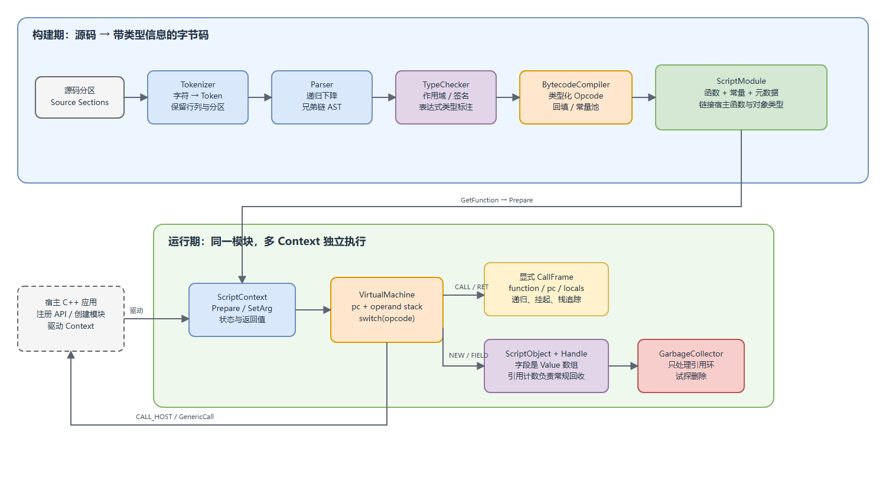
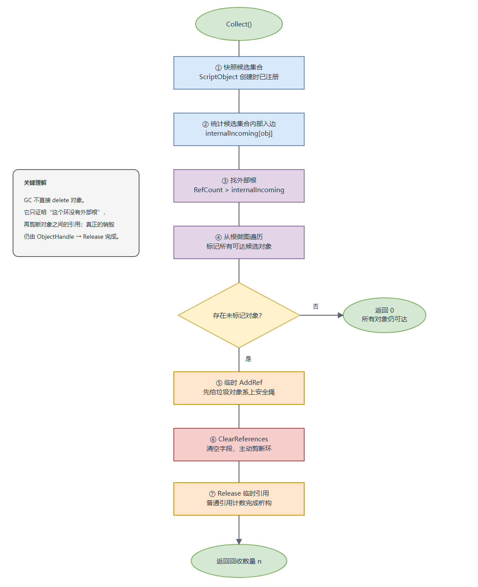

# 从 `Print(42)` 到可嵌入虚拟机：mini_angelscript 技术分享

> 一句话定位：这是一个用约 2,800 行 C++17 库代码，把“源码如何变成可暂停、可嵌入、可回收对象的程序”完整摊开给你看的教学型脚本引擎。

## 分享导览

这份报告适合熟悉 C++、但不要求写过编译器或虚拟机的听众。建议分享时长 45–60 分钟：

| 时间 | 主题 | 希望听众带走什么 |
| --- | --- | --- |
| 5 分钟 | 项目为何存在 | 它是教学实现，不是缩水版生产 SDK |
| 15 分钟 | 编译流水线 | Token、AST、静态类型和字节码怎样接力 |
| 15 分钟 | VM 与宿主桥接 | 为什么显式调用帧是递归、挂起和栈追踪的共同支点 |
| 10 分钟 | 对象与循环 GC | 引用计数负责日常，试探删除专治“抱团不撒手” |
| 10 分钟 | 工程取舍与演进 | 哪些简化让算法更清楚，哪些边界需要生产化补强 |

## 先看全貌：它不是一个“大号计算器”

`mini_angelscript` 模仿 AngelScript 的核心思想，但明确不追求 ABI 或源码兼容。仓库当前有 16 个按学习阶段组织的提交、`00` 到 `15` 的配套设计笔记，以及一条完整链路：

```text
源码 → Token → AST → 静态类型 → 类型化字节码 → 模块 → Context / VM
                                                    ↘ 宿主函数
                                                    ↘ 脚本对象与 GC
```

按物理行统计，库实现约为 2,124 行 `.cpp` 与 720 行公开头文件；测试约 579 行，包含 32 个测试用例。体量不大，但语言前端、执行器、嵌入 API 和对象系统都没有只做“接口占位”。



图源可编辑：[整体架构 draw.io](./diagrams/mini-as-architecture.drawio)；高质量矢量预览：[SVG](./diagrams/mini-as-architecture.svg)。

这张图里最重要的边界不是“编译器”和“虚拟机”，而是三种变化速度不同的对象：

- `ScriptEngine` 保存全局配置、宿主注册、模块与类型信息，生命周期最长；
- `ScriptModule` 保存构建后的函数与元数据，构建完成后主要只读；
- `ScriptContext` 保存参数、栈、程序计数器与执行状态，可为同一个函数创建很多份。

这让“同一份代码，多次独立执行”成为自然结果，而不是在一个全局解释器里反复清状态。

## 第一幕：编译流水线像一条不允许夹带私货的物流线

### 1. `DataType` 和 `Value`：货物标签与箱内实物

项目从一开始就把编译期知识和运行期数据分开：

- `DataType` 回答“这个表达式被允许做什么”；
- `Value` 回答“运行时这个位置实际装了什么”。

`Value` 使用 `std::variant` 保存 `bool`、`int32_t`、`float`、`string` 与 `ObjectHandle`。这比生产 VM 的紧凑槽位更占空间，却非常适合教学：调试器里看到的不是一块需要猜类型的比特，而是一个透明、带标签的值。核心定义见 [`core.hpp`](../include/mini_as/core.hpp)。

这个区分一路贯穿后续设计：类型检查器先给表达式贴标签，字节码编译器再据此选择 `ADD_I` 还是 `ADD_F`，VM 不必在热点路径上重新做运算符重载解析。

### 2. Tokenizer：只向前走，但从不丢掉“案发地址”

词法器是手写的单向状态机。它处理最长匹配（例如 `=` 与 `==`）、注释、字符串和关键字后分类，并为每个 Token 保存 `section / row / column / offset`。

这里有一个很有工程味的决定：源码错误不通过异常打断扫描。词法器把问题交给 `DiagnosticSink`，随后仍然补出结束 Token。这样一次构建可以收集多个错误，而不是让用户进入“修一个、编译一次、再发现下一个”的打地鼠模式。实现入口见 [`tokenizer.cpp`](../src/tokenizer.cpp)。

### 3. Parser：函数调用图就是语法优先级表

Parser 使用递归下降，每一级优先级对应一个函数：

```text
assignment
  → or
    → and
      → equality
        → comparison
          → term
            → factor
              → unary
                → call
                  → primary
```

因此 `a + b * c` 在生成时就已经是 `+` 节点包住右侧 `*` 节点，不需要事后“修树”。

AST 也刻意没有做成庞大的 C++ 继承体系。所有语法共用一个 `AstNode`，通过 `firstChild / nextSibling` 表达任意数量的孩子，由 `AstArena` 统一持有节点。可以把它想成一列火车：节点只知道第一节子车厢，车厢之间再用兄弟指针串起来。结构紧凑，遍历规则统一，代价是访问特定语法形状时需要依赖约定。定义见 [`parser.hpp`](../include/mini_as/parser.hpp)。

### 4. TypeChecker：先登记所有函数，再进入函数体

类型检查分两遍：

1. 预声明类、接口和函数签名；
2. 进入函数体，维护词法作用域栈并标注每个表达式的 `inferredType`。

第一遍让“先调用、后定义”和递归不再是特殊情况。调用解析会在同名同参数个数的候选中计算转换成本；当前唯一通用隐式数值转换是 `int → float`，精确匹配成本为 0，转换成本为 1。

作用域是 `vector<unordered_map<string, DataType>>`：声明只查当前层，查找从内到外。因此同层重名报错，内层遮蔽外层合法。这套规则简单，却已经展示了静态语言最核心的名字绑定。实现见 [`type_checker.cpp`](../src/type_checker.cpp)。

### 5. BytecodeCompiler：把“语义”兑换成 37 种明确动作

字节码共有 37 个 Opcode，覆盖常量、局部槽、类型转换、算术、比较、跳转、脚本调用、宿主调用、对象字段和返回。它不是“万能 ADD”，而是 `AddInt / AddFloat / Concat` 三条不同指令。

例如：

```angelscript
float calc(int x) {
    float y = x;
    return y + 0.5;
}
```

会被降级成类似下面的指令序列：

```text
SUSPEND
LOAD_LOCAL 0
TO_FLOAT
STORE_LOCAL 1
SUSPEND
LOAD_LOCAL 1
PUSH_CONST 0
ADD_F
RET
```

两个细节尤其值得讲：

- 赋值表达式先 `DUP` 再 `STORE_LOCAL`，既保存变量，又把赋值结果留给外层表达式；
- `if`、`while`、`&&`、`||` 都先发出未知目标跳转，等目标位置确定后回填。短路求值因此不是 VM 的魔法，而是编译器生成的控制流。

每条指令直接携带 `SourceLocation`。生产引擎通常会压缩行号表；这个项目选择多占一点内存，换来反汇编、挂起回调和运行时异常之间一眼可见的对应关系。实现见 [`bytecode.cpp`](../src/bytecode.cpp)。

## 第二幕：VM 为什么不直接递归调用 C++ 函数

树解释器在早期里程碑已经能执行 `Print(6 * 7);`。既然能跑，为什么还要字节码和 VM？

因为树解释器借用了 C++ 调用栈。脚本递归得越深，C++ 栈就越深；想在任意语句暂停，还要保存一整串本地递归现场。VM 则把现场搬到堆上，自己掌握三个核心部件：

- operand stack：表达式中间值；
- locals：当前函数的参数与局部变量；
- call stack：保存调用者的 `function / pc / locals`。

执行循环本质上是：

```cpp
while (state == Active) {
    instruction = code[pc++];
    switch (instruction.opcode) {
        // 改栈、跳转、调用、返回……
    }
}
```

### 显式 CallFrame：一块同时支撑四种能力的积木

遇到 `CALL` 时，VM 从操作数栈逆序弹出参数，保存调用者帧，为被调函数创建新的 locals；遇到 `RET` 时再恢复。调用深度上限显式设为 1024，溢出会成为脚本异常，而不是把宿主进程的原生栈一起冲垮。核心分派见 [`vm.cpp`](../src/vm.cpp)。

显式帧同时带来：

1. 递归和前向调用；
2. 挂起后原地恢复；
3. 异常时稳定的脚本栈追踪；
4. 宿主可以设置清晰的执行预算。

`SUSPEND` 指令被插在每条语句前。正常路径只检查一个标志；宿主请求挂起时，VM 把状态改成 `Suspended` 并返回，`pc`、locals、operand stack 与所有 CallFrame 都留在堆上。再次 `Execute()` 实际调用 `Continue()`，从下一条指令接着走。

这是一种很漂亮的“把控制权数据化”：程序执行到哪里，不再藏在 C++ 栈里，而是显式存在对象字段中。

## 第三幕：宿主桥接——不碰 ABI，也能让两种世界握手

宿主通过字符串声明注册函数：

```cpp
engine->RegisterGlobalFunction(
    "void Print(string &in)",
    [](mini_as::GenericCall& call) {
        std::cout << call.GetArgString(0);
    });
```

注册字符串会被解析成与脚本函数相同的 `FunctionSignature`。因此重载匹配和 `int → float` 转换发生在编译期；运行时的 `CALL_HOST` 只做四件事：

1. 按签名从栈中取出参数；
2. 构造 `GenericCall`；
3. 调用类型擦除后的 C++ 回调；
4. 校验返回值类型，传播宿主异常。

这不是原生 ABI 桥。它不会把 VM 槽位硬塞进 CPU 参数寄存器，也不需要平台汇编。代价是多一层 `Value` 与动态检查，收益是可移植、可读，而且宿主异常边界非常清楚。相关实现见 [`generic.cpp`](../src/generic.cpp) 与 [`vm.cpp`](../src/vm.cpp)。

## 第四幕：对象系统——引用计数管日常，GC 处理“抱团”

`ObjectHandle` 是侵入式引用计数的 RAII 外壳：复制对应 `AddRef`，移动转交指针，析构对应 `Release`。因为 `Value` 本身可以保存 `ObjectHandle`，参数、局部变量、返回值、操作数栈与宿主调用自动共享同一套生命周期规则，不需要为每个字节码槽再设计清理指令。

脚本类实例 `ScriptObject` 的字段是按编译期稳定索引排列的 `Value` 数组。`NEW_OBJECT` 创建对象，`LOAD_FIELD / STORE_FIELD` 直接按索引访问；空句柄或非脚本对象访问会变成带源码位置的运行时异常。

引用计数的经典难题是环：A 指向 B，B 又指向 A，外界已经没人使用它们，但两边计数都不是 0。项目用一次停顿式试探删除解决：



图源可编辑：[循环 GC draw.io](./diagrams/mini-as-cycle-gc.drawio)；高质量矢量预览：[SVG](./diagrams/mini-as-cycle-gc.svg)。

算法的关键不是“发现环”，而是判断环有没有外部根：

```text
外部引用数 = 真实 RefCount - 候选集合内部入边数
```

若结果大于 0，该对象就是根；从根能走到的候选都必须保留。剩余未标记对象才是垃圾。回收器先给这些对象临时 `AddRef`，再清空对象字段剪断环，最后释放临时引用，让普通引用计数路径完成析构并从候选集注销。

也就是说，GC 不另造一套销毁机制；它只负责证明“没人从外面抓着这群对象”，再把死结解开。实现集中在 [`object.cpp`](../src/object.cpp)。

## 一次完整调用怎样穿过系统

公开 API 刻意接近 AngelScript 教程的心智模型：

```cpp
auto engine = mini_as::CreateScriptEngine();
engine->RegisterGlobalFunction("void Print(string &in)", printCallback);

auto* module = engine->GetModule("tutorial");
module->AddScriptSection("script.as", source);
if (!module->Build()) { /* 读取诊断 */ }

auto context = engine->CreateContext();
context->Prepare(module->GetFunctionByDecl("float calc(float, float)"));
context->SetArgFloat(0, 3.14f);
context->SetArgFloat(1, 2.71f);

auto state = context->Execute();
if (state == mini_as::ExecutionState::Finished) {
    std::cout << context->GetReturnFloat();
}
```

背后的真实顺序是：

1. Engine 解析并保存宿主函数签名；
2. Module 合并多个源码分区，但每个 Token 仍保留原分区名；
3. Parser 与 TypeChecker 完成前端检查；
4. BytecodeCompiler 先建立所有脚本函数，再编译函数体并链接调用目标；
5. Context 验证实参类型并准备 VM；
6. VM 执行，必要时通过 `GenericCall` 回到宿主；
7. 返回、挂起、中止或异常都通过 `ExecutionState` 显式交还宿主。

## 最值得借鉴的五个设计选择

| 选择 | 为什么好 | 付出的代价 |
| --- | --- | --- |
| 一种 `AstNode` + Arena + 兄弟链 | 所有语法用相同遍历模型，所有权简单 | 节点形状依赖约定，类型安全弱于专用 AST 类 |
| `DataType` 与 `Value` 分离 | 静态规则和运行时存储边界清晰 | 类型信息在多层结构中重复保存 |
| 类型化 Opcode | VM 热路径直接，错误更早暴露 | Opcode 数量增加，编译器要负责插转换 |
| 堆上的显式执行帧 | 递归、挂起、栈追踪共用一套机制 | 比借用原生调用栈多一层数据搬运 |
| RC + 试探删除 | 普通对象立即析构，环也能回收 | GC 停顿，候选集合与遍历结构不适合大规模堆 |

还有一个贯穿全仓库的教学取舍：优先使用标准库和直白数据结构。生产 AngelScript 有大量平台、ABI、内存与容器层；这里主动删去那些“必要但喧闹”的部分，让读者把注意力放在算法骨架上。

## 边界与风险：教学引擎不应假装生产引擎

项目自己已经明确排除了原生 ABI 桥、继承、模板、脚本异常语法、委托、JIT、序列化、增量 GC 和生产级优化器。除此之外，从当前实现还可以看到几条值得在分享中主动说清的边界：

### 1. 模块重建与 Context 生命周期没有硬隔离

`ScriptContext` 保存 `BytecodeFunction*`，而 Module 重建会替换内部 `BytecodeModule`。因此已经 Prepare 的 Context 与模块重建并发或交错使用，可能持有失效函数指针。当前合理使用约定应是：模块稳定后再创建/执行 Context，重建前销毁旧 Context。生产化可以用共享所有权、版本化模块或执行期读锁明确约束。

### 2. “成功后替换”不等于“失败时保留旧版本”

构建确实先生成 candidate，成功后才移动到 `bytecode_`；但当前失败分支会把 `bytecode_` 清空。若目标是热重载式原子构建，失败时通常应保留上一个可运行版本。这是文档表述与实现语义之间值得进一步对齐的地方。

### 3. 原子引用计数不代表整个对象系统线程安全

`RefObject` 的计数是原子的，但 GC 候选集合、Module、Context 和类型注册都没有并发保护。当前模型更接近“单线程执行，宿主在外层调度”；不能因为看到 `atomic` 就推断多线程脚本执行安全。

### 4. 类型与调用模型仍是刻意缩小的子集

方法调用字节码、完整动态接口分派、继承、多态重载规则和用户构造函数均未实现。接口目前主要完成编译期签名验证与方法表解析，尚不是完整的虚调用系统。

## 测试与可复现性

测试覆盖层次相当健康：

- 前端：Token 位置、未终止输入、运算符优先级、作用域和错误诊断；
- 编译：类型化 Opcode、隐式转换、反汇编行号；
- VM：混合数值、除零、控制流、短路、挂起恢复；
- 嵌入：模块策略、跨分区构建、参数校验、前向调用与递归；
- 对象：引用计数、跨 Context 句柄、字段、接口验证；
- GC：自环、双对象环、外部根保护；
- 端到端：教程脚本、宿主 Print/Clock、回调中止与三层异常栈。

本次在全新构建目录、Ninja + GCC 13.2 下验证：测试程序报告 `32 tests passed`，CTest 为 `2/2 passed`。

```powershell
cmake -S . -B cmake-build-report -G Ninja -DCMAKE_BUILD_TYPE=Debug
cmake --build cmake-build-report
ctest --test-dir cmake-build-report --output-on-failure
```

需要注意两点：

- 编译会报告少量 `-Wmissing-field-initializers`，来自聚合初始化只显式填写状态或签名；行为正确，但补全初始化能让高警告等级构建更安静。
- 切换 MinGW/GCC 工具链时不要复用旧 CMake 缓存。本次旧的 CLion/MinGW 15.2 构建目录曾出现端到端堆异常，而新目录使用 GCC 13.2 后全部通过；这是构建环境差异，不应直接归因于脚本语义。

## 如果继续演进，我会怎么排优先级

### 第一优先级：把生命周期契约变成代码约束

先解决模块重建与 Context 指针失效问题，再定义“Build 失败是否保留旧模块”。这是从教学 Demo 迈向可靠嵌入组件时最先会撞到的边界。

### 第二优先级：补可观测性与资源上限

已有行回调、异常位置、调用栈和反汇编，这是很好的地基。下一步可加入：

- 操作数栈和对象数量上限；
- 每 Context 指令预算，而不只依赖语句级回调；
- GC 统计（候选数、根数、标记数、回收耗时）；
- 模块构建产物摘要与稳定字节码校验。

### 第三优先级：在保持可读性的前提下扩语言

优先补方法调用与真实接口分派，因为现有类、字段和接口元数据已经铺好大部分道路。之后再考虑构造函数、继承或更完整的重载规则。JIT 和平台 ABI 桥很诱人，但会迅速淹没这个项目最珍贵的“算法可见性”。

## 结语：小，不等于浅

这个仓库最有价值的地方，不是“又实现了一门小语言”，而是展示了几个本可分散在不同教材里的主题其实共享同一条主线：

- 静态类型决定字节码形状；
- 字节码形状简化 VM；
- 显式 VM 状态带来挂起与栈追踪；
- `Value` 统一宿主、脚本与对象边界；
- 引用枚举让对象系统接上循环 GC。

如果只能记住一句话：**编译器是在把隐含规则变成显式数据，虚拟机是在把隐含控制流变成显式状态。** `mini_angelscript` 的教学魅力，就在于这些“显式化”的过程都小到可以读懂，又完整到能够真正运行。

## 分享后的讨论题

1. 如果要支持多线程同时执行 Context，哪些对象必须加锁，哪些更适合做不可变快照？
2. 如果 `SUSPEND` 从“每条语句一次”改成“每 N 条指令一次”，可控性和性能会怎样变化？
3. 模块热重载时，旧 Context 应继续执行旧版本，还是强制失效？API 应如何表达？
4. 试探删除 GC 能否增量化？怎样限制单次停顿而不破坏外部根判断？
5. 如果把 `std::variant<Value>` 改为紧凑槽位，哪些地方会明显变快，哪些调试能力会丢失？
